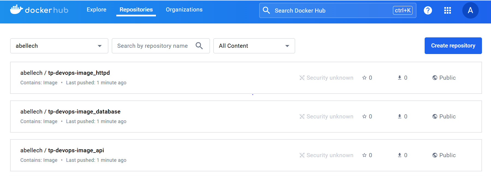
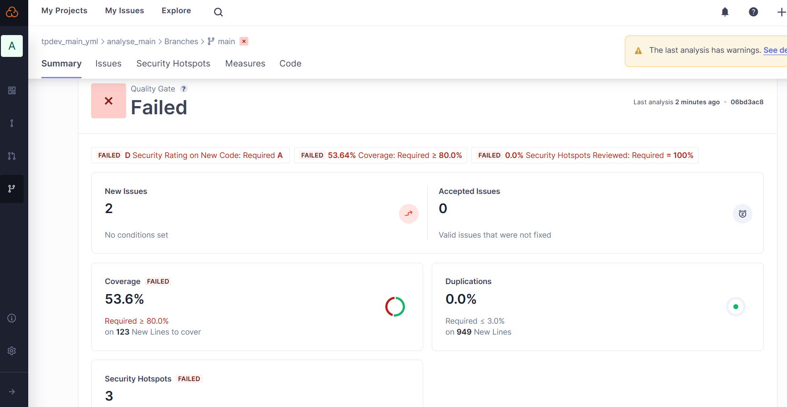
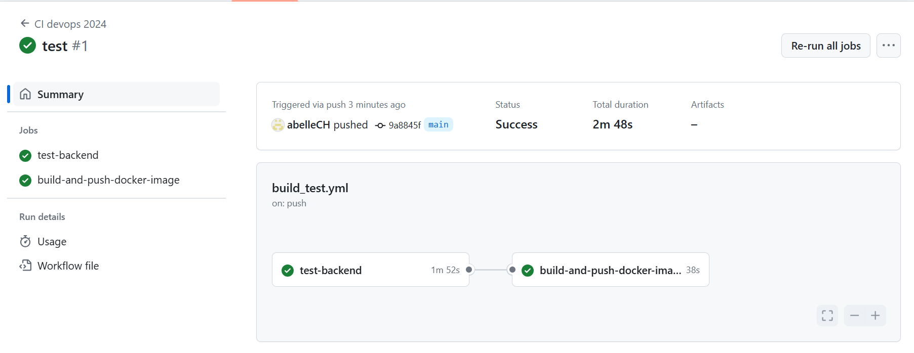

# TP Part 02 Github Actions - Abelle Charlemagne
## Target Application
Complete pipeline workflow for testing and delivering your software application.
## Build and test your Application
### 2-1 What are testcontainers?

Testcontainers is a popular testing library in the Java ecosystem that allows developers to create and manage lightweight, throwaway instances of databases, message brokers, web servers, and other services running in Docker containers

### 2-2 Document your Github Actions configurations.

```yaml
name: CI devops 2024
# The name of the GitHub Actions workflow

on:
  # Define the events that will trigger the workflow
  push:
    branches: 
      - main
      - develop
      # Trigger the workflow on pushes to the main and develop branches
  pull_request:
  # Trigger the workflow on pull requests

jobs:
  test-backend: 
    # Define a job named "test-backend"
    runs-on: ubuntu-22.04
    # Specify that the job should run on an Ubuntu 22.04 runner
    steps:
    # Define the steps to be executed in the job

     # Checkout your GitHub code using the actions/checkout@v2.5.0 action
      - uses: actions/checkout@v2.5.0

     # Use another action (actions/setup-java@v3) to set up JDK 17
      - name: Set up JDK 17
        uses: actions/setup-java@v3
        with:
          distribution: 'temurin'
          java-version: '17'
          # Specify the distribution and version of Java to be set up

     # Finally, build your app with the latest Maven command
      - name: Build and test with Maven
        run: mvn clean verify --file TP1_devops/API/simple-api-student-main/pom.xml
        # Run Maven to clean and verify the project using the specified pom.xml file
```
## First steps into the CD World
### Working CI & Docker images pushed to your repository.
I'm now able to find my docker images on my dockerhub repository.




## Register to SonarCloud
After connecting to sonar, creating an organization and a project, we used SonarCloud analysis in our pipeline.

### Document your quality gate configuration.

We can see failures and vulnerabilities, there's 53.6% coverage when 80% is required for satisfying code, there are no security hostposts as it should be 100% flawless, and security is estimated at level D against the expected A. So we can go into more detail and modify/add what's needed, thanks to this analysis.



## Bonus: split pipelines (Optional)
We have separated our jobs into different workflows so that they respect 2 things:
- test-backend must be launched on develop and master branch and build-and-push-docker-image on master only.
- The job that pushes the docker api image must be launched only if test-backend is passed.

Here is the code associated : 

- test-backend :

```yaml
name: test-backend 

on:
  push:
    branches:
      - main
      - develop
  pull_request:

jobs:
  test-backend:
    runs-on: ubuntu-22.04
    steps:
      # Checkout your GitHub code using actions/checkout@v2.5.0
      - uses: actions/checkout@v2.5.0

      # Set up JDK 17 using actions/setup-java@v3
      - name: Set up JDK 17
        uses: actions/setup-java@v3
        with:
          distribution: 'temurin'
          java-version: '17'

      # Build and test with Maven
      - name: Build and test with Maven
        run: mvn -B verify sonar:sonar -Dsonar.projectKey=tpdev-main-yml_analyse-main -Dsonar.organization=tpdev-main-yml -Dsonar.host.url=https://sonarcloud.io -Dsonar.login=${{ secrets.SONAR_TOKEN }} --file TP1_devops/API/simple-api-student-main/pom.xml

```
- build-and-push-docker-image :

```yaml
name: build-and-push-docker-image

on:
  workflow_run:
    workflows: ["test-backend"]
    types:
      - completed
  push:
    branches:
      - main
  pull_request:

jobs:
  build-and-push-docker-image:
    if: github.event.workflow_run.conclusion == 'success'
    runs-on: ubuntu-22.04
    steps:
      - name: Checkout code
        uses: actions/checkout@v2.5.0

      - name: Verify Dockerfile paths
        run: |
          ls -la TP1_devops/API/simple-api-student-main
          ls -la TP1_devops/database
          ls -la TP1_devops/server

      - name: Login to DockerHub
        run: echo "${{ secrets.DOCKER_TOKEN }}" | docker login -u "${{ secrets.DOCKER_USERNAME }}" --password-stdin

      - name: Build image and push backend
        uses: docker/build-push-action@v3
        with:
          context: TP1_devops/API/simple-api-student-main
          tags: ${{ secrets.DOCKER_USERNAME }}/tp-devops-image_api:latest

      - name: Build image and push database
        uses: docker/build-push-action@v3
        with:
          context: TP1_devops/database
          tags: ${{ secrets.DOCKER_USERNAME }}/tp-devops-image_database:latest

      - name: Build image and push httpd
        uses: docker/build-push-action@v3
        with:
          context: TP1_devops/server
          tags: ${{ secrets.DOCKER_USERNAME }}/tp-devops-image_httpd:latest

```
