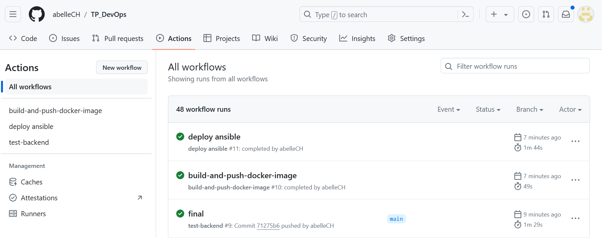

# TP Part 03 Ansible - Abelle Charlemagne
## Target Application
Install and deploy your application automatically with ansible.
## Introduction
### 3-1 Document your inventory and base commands;

For the connection :
1) Open a WSL terminal and download ansible with ``sudo apt install ansible``
2) Put the key in the ./ssh
3) Set up access with ``chmod 400 .ssh/id_rsa``
4) ``ssh -i .ssh/id_rsa centos@abelle.charlemagne.takima.cloud``

For the ping :
1) Change the folder stup.yml with the hostname and path to key (See code below)
3) Access to ``/mnt/c/Users/Admin/OneDrive/Documents/Bureau/TP_devops/TP1_devops/ansible``
4) ``ansible all -i inventories/setup.yml -m setup -a "filter=ansible_distribution*"``

In the inventory we have the file setup.yml :
```yaml
all:
 vars:
   ansible_user: centos
   ansible_ssh_private_key_file: ~/.ssh/id_rsa
 children:
   prod:
     hosts: abelle.charlemagne.takima.cloud 
```


### 3-2 Document your playbook
In the playbook file we finally just have :

```yaml
- hosts: all
  gather_facts: false
  become: true

  roles:
    - docker
```
That calls the docker roles and in this directory we have 
- in tasks :
````yaml
# tasks file for roles/docker
  - name: Install device-mapper-persistent-data
    yum:
      name: device-mapper-persistent-data
      state: latest

  - name: Install lvm2
    yum:
      name: lvm2
      state: latest

  - name: add repo docker
    command:
      cmd: sudo yum-config-manager --add-repo=https://download.docker.com/linux/centos/docker-ce.repo

  - name: Install Docker
    yum:
      name: docker-ce
      state: present

  - name: Install python3
    yum:
      name: python3
      state: present

  - name: Install docker with Python 3
    pip:
      name: docker
      executable: pip3
    vars:
      ansible_python_interpreter: /usr/bin/python3

  - name: Make sure Docker is running
    service: name=docker state=started
    tags: docker
````


## Deploy your App

Here is the playbook that specifies a list of Ansible roles to be applied :

```yaml
- hosts: all
  gather_facts: false
  become: true

  roles:
    - docker
    - network
    - database
    - api
    - proxy
```

We have 5 roles, and in each of these we have tasks that contain the main list of tasks to be carried out by the role.

- Install docker

```yaml
---
# tasks file for roles/docker
  - name: Install device-mapper-persistent-data
    yum:
      name: device-mapper-persistent-data
      state: latest

  - name: Install lvm2
    yum:
      name: lvm2
      state: latest

  - name: add repo docker
    command:
      cmd: sudo yum-config-manager --add-repo=https://download.docker.com/linux/centos/docker-ce.repo

  - name: Install Docker
    yum:
      name: docker-ce
      state: present

  - name: Install python3
    yum:
      name: python3
      state: present

  - name: Install docker with Python 3
    pip:
      name: docker
      executable: pip3

  - name: Make sure Docker is running
    service: name=docker state=started
    tags: docker

  - name: Login to Docker
    docker_login:
      username: abellech
      password: dckr_pat_TildHT5koHWV-bKkNwnlRTgWu2w
      reauthorize: yes 
    vars:
      ansible_python_interpreter: /usr/bin/python3
```
We install and configure Docker, as well as Python3 and the Docker module for Python. We check that Docker is running and log in to retrieve our images later.


- Create network

```yaml
---
  - name: Create a network
    docker_network:
      name: app-network
    vars:
      ansible_python_interpreter: /usr/bin/python3
```

We create the network called app-network and using python 3 is specified.

For the next 3 roles, we'll set the state to started to ensure that the container is started, notify the network we're using, give the container a name, provide the image we want to use and the necessary environment variables.

- Launch database

```yaml
---
# tasks file for roles/database

- name: Launch database
  docker_container:
    state: started
    pull: true
    networks: 
      - name: app-network
    name: database
    image: abellech/tp-devops-image_database
    env:
      POSTGRES_DB: db
      POSTGRES_USER: usr
      POSTGRES_PASSWORD: pwd
  vars:
      ansible_python_interpreter: /usr/bin/python3  
```


- Launch api

```yaml
---
# tasks file for roles/api

- name: Launch API
  docker_container:
    state: started
    pull: true
    networks: 
      - name: app-network
    name: api
    image: abellech/tp-devops-image_api
    env:
      DB_host: database
      DB_port: "5432"
      DB_name: db
      DB_user: usr
      DB_mdp: pwd
  vars:
      ansible_python_interpreter: /usr/bin/python3  
```

- Launch proxy

```yaml
---
# tasks file for roles/proxy
- name: Launch server
  docker_container:
    state: started
    pull: true
    networks: 
      - name: app-network
    name: server
    image: abellech/tp-devops-image_httpd
    env:
      BACKEND_host: api
    ports:
            - "80:80"
  vars:
      ansible_python_interpreter: /usr/bin/python3  
```

## Continuous Deployment

I created an other workflow running after the 2 previous :

```yaml
name: deploy ansible

on:
  workflow_run:
    workflows: ["build-and-push-docker-image"]
    types:
      - completed
    push:
    branches:
      - main
      
jobs:
  deploy:
    if: github.event.workflow_run.conclusion == 'success'
    runs-on: ubuntu-22.04
    steps:
      - name: Checkout code
        uses: actions/checkout@v2.5.0

      - name: Set up Python
        uses: actions/setup-python@v2
        with:
          python-version: '3.x'

      - name: Install Ansible
        run: |
          python -m pip install --upgrade pip
          pip install ansible

      - name: Add SSH private key
        run: |
          mkdir -p ~/.ssh
          echo "${{ secrets.SSH_PRIVATE_KEY }}" > ~/.ssh/id_rsa
          chmod 600 ~/.ssh/id_rsa

      - name: Run Ansible Playbook
        env:
          ANSIBLE_HOST_KEY_CHECKING: 'false'
        run: ansible-playbook -i TP1_devops/ansible/inventories/setup.yml TP1_devops/ansible/playbook.yml
```



## Front
I've made the necessary changes, but my image has a loading problem.

Here's my front role:

```yaml
---
# tasks file for roles/front
- name: Set front
  docker_container:
    state: started
    pull: true
    networks: 
      - name: app-network
    name: front
    image: abellech/tp-devops-image_front
    ports:
            - "82:80"
  vars:
      ansible_python_interpreter: /usr/bin/python3  

```

And finally the playbook with the addition of the role front :

```yaml
- hosts: all
  gather_facts: false
  become: true

  roles:
    - docker
    - network
    - database
    - api
    - proxy
    - front
```
To deploy, I added the in the workflow :

```yaml
- name: Build image and push front
        uses: docker/build-push-action@v3
        with:
          context: TP1_devops/devops-front-main
          tags: ${{ secrets.DOCKER_USERNAME }}/tp-devops-image_front:latest
          push: ${{ github.ref == 'refs/heads/main' }}
```

